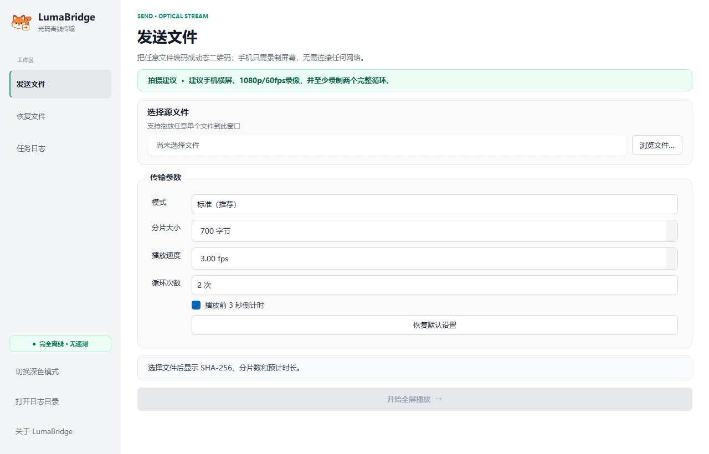
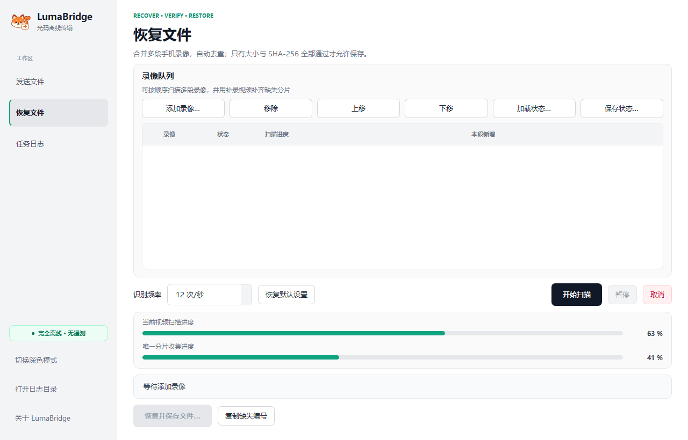

# LumaBridge

[English](README.en.md) · [简体中文](README.zh-CN.md)

## English

LumaBridge is a fully offline desktop application that transfers files through a stream of QR codes and a phone recording. It uses no network, Wi-Fi, Bluetooth, account, telemetry, or cloud service.

### Use cases

LumaBridge is intended for situations where two devices have no network, Bluetooth, or usable USB connection, but data can still be transferred through a screen and a phone camera, for example:

- An offline computer cannot connect to the internet or a local network.
- Wi-Fi, Ethernet, Bluetooth, or USB hardware is unavailable or damaged.
- A small log, configuration, or installer file must be transferred in an isolated test environment.
- A temporary device lacks a compatible data interface.
- Installing a phone app is impractical, so only the phone camera can be used.
- QR-code chunks need to be collected across multiple recordings and restored later on another computer.

LumaBridge is best suited to small files ranging from a few KB to a few MB. QR playback and recording time increase significantly for large files; prefer a storage drive, local network, or another high-speed transfer method when one is available.

#### Example

An offline Windows 11 computer cannot access a network and its USB ports are unavailable. A compressed archive of about 600 KB must be transferred to another computer.

1. Open LumaBridge on the offline computer and select **Send File**.
2. Select the archive and play the dynamic QR stream using Standard mode.
3. Record two complete loops with the phone held horizontally.
4. Take the recording to the other computer and open **Recover File** in LumaBridge.
5. Add the phone recording and start scanning.
6. LumaBridge recognizes, deduplicates, and collects QR chunks automatically.
7. After every chunk is collected, LumaBridge restores the original file and verifies its SHA-256 digest.
8. Use the restored archive after the application reports successful recovery.

If the first recording is missing some chunks, save the recovery state, record an additional video, and continue scanning without starting over.

> Transfer only data that you own or are explicitly authorized to handle, and follow your organization’s security policies. Nearby cameras can read the QR display, so LumaBridge does not provide confidentiality by default.

## Interface / 界面

| Send / 发送文件 | Recover / 恢复文件 |
| --- | --- |
|  |  |

- [English README](README.en.md)
- [English User Manual](docs/USER_MANUAL.en.md)
- [Third-party licenses](LICENSES.md)

## 简体中文

LumaBridge 是一款完全离线的动态二维码文件传输桌面软件。它通过“电脑播放二维码 + 手机录像 + 接收电脑扫描录像”传输文件，不使用网络、Wi-Fi、蓝牙、账号、遥测或云服务。

### 适用场景

LumaBridge 适用于两台设备之间没有网络、蓝牙或可用 USB 连接，但可以通过屏幕和手机摄像头传递数据的情况，例如：

- 离线电脑无法连接互联网或局域网；
- Wi-Fi、网口、蓝牙或 USB 接口损坏；
- 隔离测试环境中需要传递少量日志、配置或安装文件；
- 临时设备缺少兼容的数据接口；
- 不方便安装手机 App，只能使用手机录像；
- 需要通过录像分多次收集二维码，再到另一台电脑恢复文件。

LumaBridge 更适合几 KB 到几 MB 的小型文件。对于大型文件，二维码播放和录像时间会明显增加，应优先考虑硬盘、局域网或其他高速传输方式。

#### 使用示例

一台离线的 Windows 11 电脑无法联网，USB 接口也不可用，现在需要将其中一个约 600 KB 的压缩包传到另一台电脑。

1. 在离线电脑上打开 LumaBridge，进入“发送文件”。
2. 选择需要传输的压缩包，并使用标准模式播放动态二维码。
3. 使用手机横屏录制两个完整循环。
4. 将录像带到另一台电脑，打开 LumaBridge 的“恢复文件”。
5. 导入手机录像并开始扫描。
6. 软件自动识别、去重并收集二维码分片。
7. 分片收齐后，软件恢复原文件并校验 SHA-256。
8. 显示“恢复成功”后，即可使用恢复后的压缩包。

如果第一次录像缺少部分分片，可以保存恢复状态，重新补录一段视频后继续扫描，不需要从头开始。

> 请只传输自己拥有或已获得明确授权的数据，并遵守所在组织的安全管理要求。二维码画面可以被周围摄像头读取，因此本工具默认不提供保密性。

- [中文 README](README.zh-CN.md)
- [中文操作手册](docs/操作手册.zh-CN.md)
- [第三方许可证](LICENSES.md)
